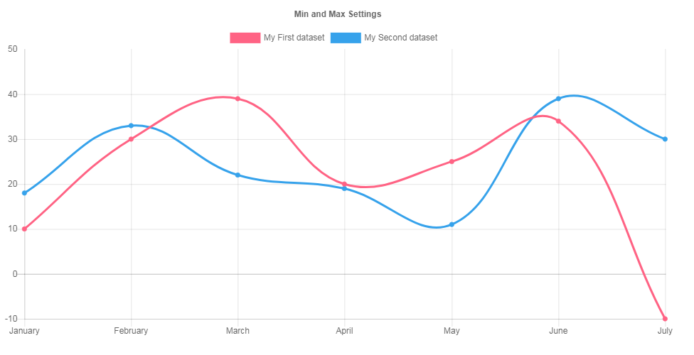
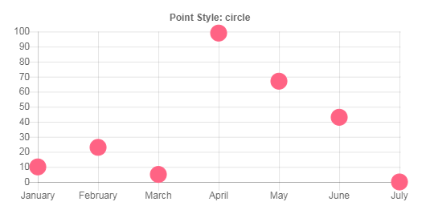
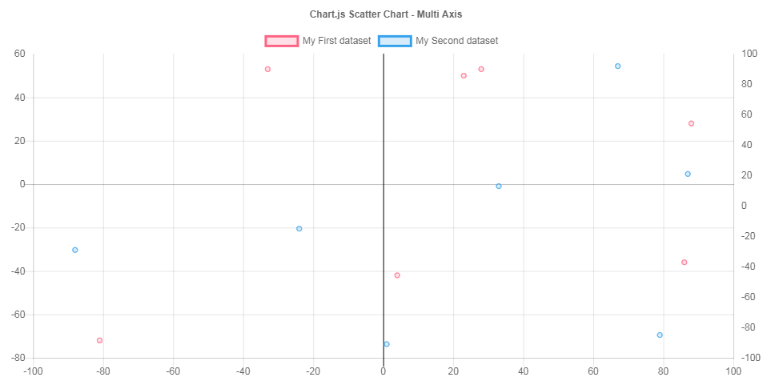
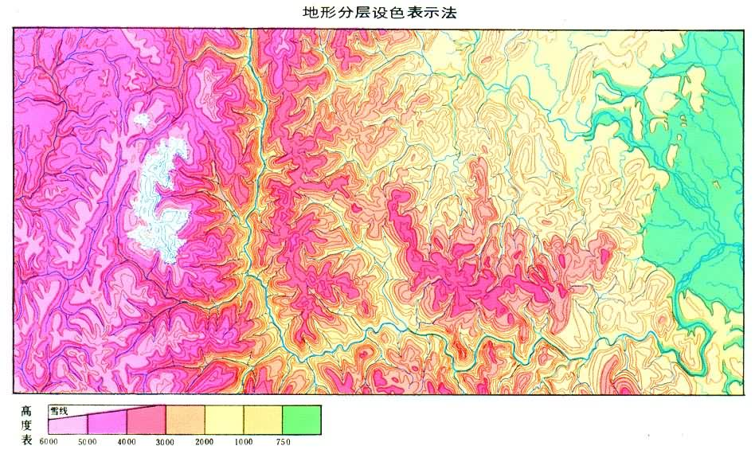

# /校內賽/計畫書

---

## 警告

此網頁為[**科展/校內賽/計畫書**](https://github.com/Andrew-Source/School-Science-Research/blob/school/plan.md)的網頁版，任何更改、建議請至原檔案處進行更改，確認OK後再開啟一個新的issue。

感謝！

---

## 理念

我最近跟研究空汙的教授討論過，以下是他所說的：

> 環保署都只有當下的資料，目前既沒資料庫，也沒跟民間同步。
> 
> 跟民間資料同步也很重要，因為環保局的測站就幾個點而已，民間就到處遍佈。

而是我就萌生了這個想法，不如我們就做一個APP來統整這些資料，然後用我們自己的方法執行分析及圖表製作。

---

## 作法

作法目前仍處於概想階段但已可以分為下列幾部分：

  * 前台
    * 顯示當下資料
    * 顯示圖表
    * 供使用者查詢之前之紀錄
  * 後台
    * 擷取資料
    * 歸納資料
    * 分析資料
    * 製作圖表

其中以**分析資料**及**製作圖表**最為困難，其中分工將於[此處](https://github.com/Andrew-Source/School-Science-Research/issues/2)討論病癒下章節統以講解。

---

## 工作分配

目前的工作將分為下列幾種：

  * 前台設計
  * 分析辦法/圖表製作
  * 後台製作

其中各自工作所使用之語言已列於[此處](https://github.com/Andrew-Source/School-Science-Research/issues/1)，下方將進行更詳細解說。

---

### 前台設計

前台的製作較簡單，只需要用[Bootstrap](http://getbootstrap.com/)製作出簡單的排列並留位置以放置圖表數據。

---

### 分析辦法/圖表製作

人總要持續創新，我們的計畫與別人不同處就是這部分。

通常大家都顯示及時數據，做個簡單的表單而已。我們將作的除了優質、美觀的圖表(參見下部分之圖1)。我們還要用數學的**斜率**來進行**簡單的**後續空氣品質情況的預測。

#### 圖表製作

圖表的製作我們將用[ChartJS](http://www.chartjs.org/)來製作，之後將詳細講解如何製作，這邊先做示範

[圖1](http://www.chartjs.org/samples/latest/scales/linear/min-max-suggested.html) (可用於當日不同時間之數值顯示)

---

[圖2](http://www.chartjs.org/samples/latest/charts/line/point-styles.html) (可用於不同地區之數值顯示)

---

[圖3](http://www.chartjs.org/samples/latest/charts/scatter/multi-axis.html) (用途未知)

---

#### 期望目標

我們期望能在各個蹭戰中，依數值作漸層上色，如下圖。

參照分層設色圖 ([來源](http://www.twword.com/wiki/%E5%9C%B0%E5%BD%A2%E8%A1%A8%E7%A4%BA%E6%B3%95))

---

### 後臺製作

後臺將用NodeJS執行以下動作。

 * 定時擷取資料
 * 分類資料

目前已有範例程式，可與此處[下載](./files/tw-aqi-data-monitor.zip)並執行`node monitor.min.js`即可 (記得先安裝NodeJS)。詳細文件可於[此處](./twaqi-doc)查閱。

---
